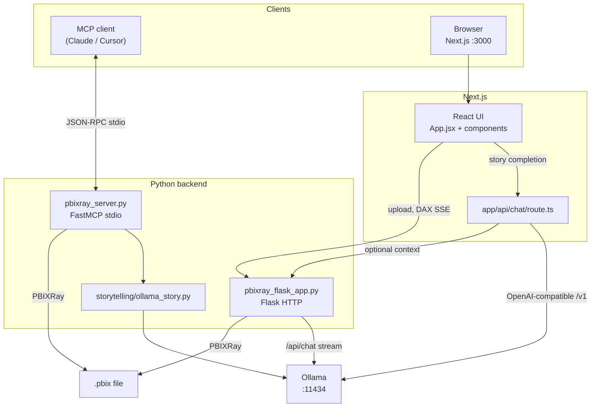
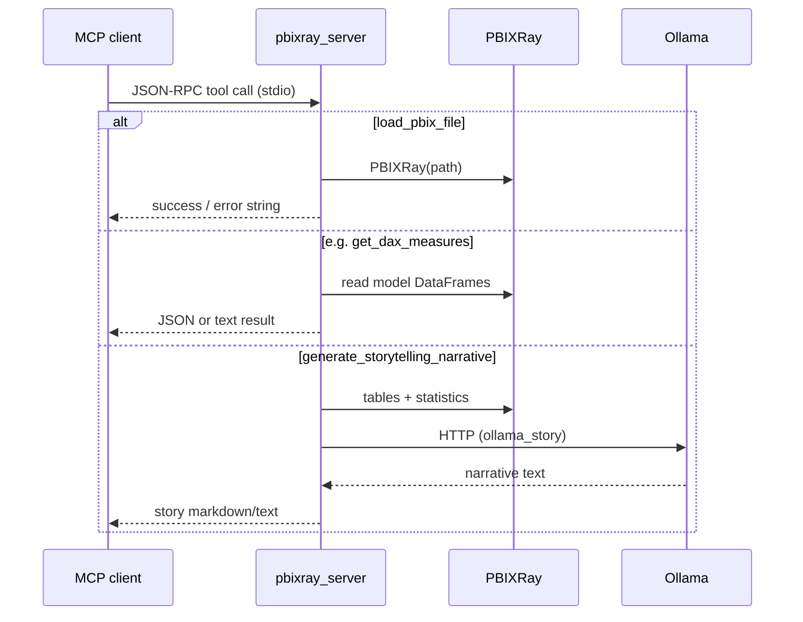
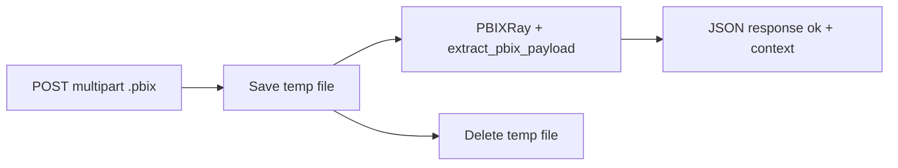
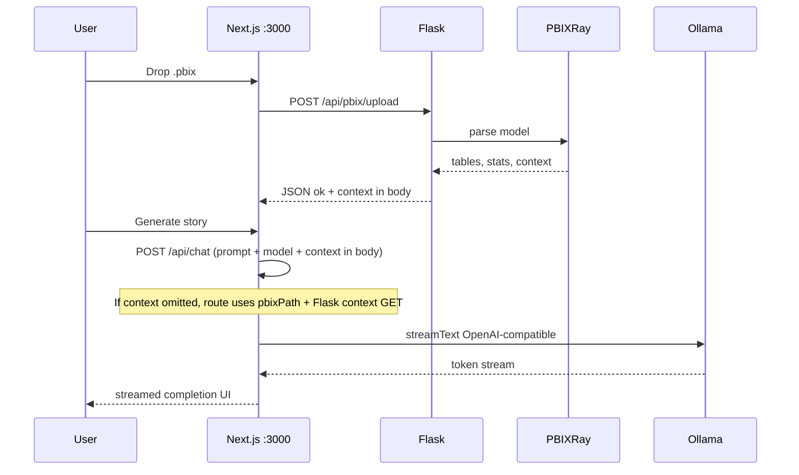
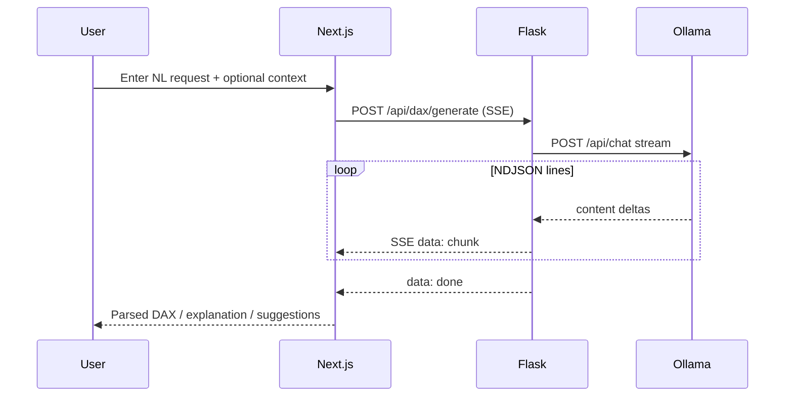

# PBIXRay MCP Server — Full Project Documentation

End-to-end reference: **MCP stdio server**, **Flask REST/HTML dashboard**, **Next.js storytelling + DAX UI**, and **Ollama** for LLM features.

---

## 1. What This Project Does

| Layer | Role |
|--------|------|
| **PBIXRay** (dependency) | Parses `.pbix` files and exposes tables, statistics, DAX, relationships, etc. |
| **`pbixray_server.py`** | Model Context Protocol (MCP) server: tools for AI clients (Claude Desktop, Cursor, etc.) over **stdio**. |
| **`pbixray_flask_app.py`** | HTTP API + legacy HTML dashboard: upload PBIX, extract model context, stream DAX generation (SSE), proxy Ollama model list. |
| **`web/`** | Next.js 14 app: file drop → Flask upload, **Storytelling** tab (Vercel AI SDK → `/api/chat` → Ollama), **DAX** tab (SSE to Flask `/api/dax/generate` → Ollama). |

---

## 2. Repository Layout

```
pbixray-mcp-server/
├── src/
│   ├── pbixray_server.py      # MCP FastMCP entry (stdio)
│   ├── pbixray_flask_app.py   # Flask: API + dashboard.html
│   └── storytelling/
│       └── ollama_story.py    # build_story_context, generate_story_with_ollama (MCP storytelling tool)
├── web/                       # Next.js UI (port 3000 by default)
│   ├── app/
│   │   ├── api/chat/route.ts  # Storytelling: streamText → Ollama OpenAI-compatible API
│   │   ├── page.tsx           # Renders src/App.jsx
│   │   └── layout.tsx
│   └── src/
│       ├── App.jsx            # Tabs: Storytelling | DAX
│       ├── context/PBIXContext.jsx
│       ├── hooks/             # useStoryGeneration, useDAXGeneration, useOllamaModels
│       └── components/        # Layout, StorytellingPage, DAXGeneratorPage, ...
├── scripts/
│   ├── run_flask_dashboard.sh # venv + picks free port 5050–5099
│   ├── run_with_ollama.sh
│   └── run_story_ui.sh
├── tests/                     # pytest (MCP/server behavior)
├── examples/config/           # Sample MCP client JSON
├── requirements.txt / pyproject.toml
└── README.md, INSTALLATION.md
```

---

## 3. High-Level Architecture



---

## 4. Backend: MCP Server (`src/pbixray_server.py`)

### 4.1 Startup and transport

- CLI: `python src/pbixray_server.py` with optional `--disallow`, `--max-rows`, `--page-size`, `--load-file`.
- Runs **`mcp.run(transport="stdio")`** — all protocol traffic on stdin/stdout; logs go to stderr.
- **`secure_tool`**: wraps `@mcp.tool` so disallowed tool names still register but return an error string.

### 4.2 Global model state

- `current_model: PBIXRay | None`, `current_model_path` — set by `load_pbix_file` (and optional `--load-file` at startup via `load_file_sync`).

### 4.3 Tools (representative list)

Registered with FastMCP; heavy work often uses `run_model_operation` + thread pool + progress.

| Tool | Purpose |
|------|---------|
| `load_pbix_file` | Load `.pbix` by filesystem path |
| `get_tables` | List model tables |
| `get_metadata` | PBIX metadata |
| `get_power_query` | M code |
| `get_m_parameters` | M parameters |
| `get_model_size` | Size in bytes |
| `get_dax_tables` / `get_dax_measures` / `get_dax_columns` | DAX artifacts |
| `get_schema` | Column types |
| `get_relationships` | Relationships |
| `get_table_contents` | Paginated row data + filters |
| `get_statistics` | Column stats (optional filters) |
| `generate_storytelling_narrative` | Builds context via `build_story_context`, then `generate_story_with_ollama` |
| `get_model_summary` | JSON summary of loaded model |

### 4.4 MCP request flow (conceptual)



---

## 5. Backend: Flask (`src/pbixray_flask_app.py`)

### 5.1 Responsibilities

- **CORS** on `/api/*` for `localhost:3000` and `3001`.
- **`extract_pbix_payload(resolved_path)`**: opens `PBIXRay`, returns JSON including `ok: true`, `tables`, `summary`, `stats_preview`, `context` (story JSON from `build_story_context`), `columns`, `measures`, `relationships`, `rawContext` (long text for LLM prompts).

### 5.2 Routes

| Method | Path | Description |
|--------|------|-------------|
| GET | `/` | Renders `dashboard.html` with default PBIX path hint |
| GET | `/storytelling` | Redirects to `STORY_UI_URL` or `/` |
| GET | `/api/pbix/context?pbix_path=` | Full payload JSON for a path on disk |
| POST | `/api/pbix/upload` | Multipart `file` → temp `.pbix` → same payload + `uploaded_name` |
| POST | `/api/dax/generate` | JSON body: `query`, optional `context`, `pbix_context`, `model` → **SSE** stream from Ollama |
| GET | `/api/ollama/models` | Proxies `GET {OLLAMA_BASE_URL}/api/tags` |
| POST | `/analyze` | Form `pbix_path` → legacy HTML dashboard with stats |

### 5.3 DAX SSE protocol

Server-Sent Events: each event line is `data: {json}\n\n` where JSON has `type`:

- `start` — includes `req_id`
- `chunk` — `text` delta from Ollama
- `error` — failure message
- `done` — stream finished

Ollama is called at `{OLLAMA_BASE_URL}/api/chat` with `stream: true`; optional `DAX_OLLAMA_NUM_CTX`, truncation via `DAX_MAX_*_CHARS`, timeouts via `DAX_OLLAMA_READ_TIMEOUT_SEC`, etc.

### 5.4 Flask flow: PBIX upload



---

## 6. Frontend: Next.js (`web/`)

### 6.1 Entry

- `app/page.tsx` imports `src/App.jsx` (client component).
- `App.jsx`: **`PBIXProvider`** wraps **`AppLayout`** with tabs **`storytelling`** | **`dax`**.

### 6.2 PBIX state (`PBIXContext.jsx`)

- **`uploadFile`**: `XMLHttpRequest` `POST` to `{NEXT_PUBLIC_FLASK_URL}/api/pbix/upload` with progress.
- On success (`data.ok`), stores `tables`, `columns`, `measures`, `relationships`, `rawContext`, `storyContext`.
- **`NEXT_PUBLIC_FLASK_URL`** default `http://127.0.0.1:5052` (must match running Flask port).

### 6.3 Storytelling (`useStoryGeneration.js` + `StorytellingPage.jsx`)

- **`useCompletion`** from `@ai-sdk/react` with `api: "/api/chat"`.
- Request body includes `model` from UI; server route can accept **`context`** (preloaded) or **`pbixPath`** to fetch context from Flask.

### 6.4 Chat API (`web/app/api/chat/route.ts`)

1. Parse `messages` or single `prompt`.
2. If no `context`, require `pbixPath` → `fetch(FLASK_URL/api/pbix/context?pbix_path=...)`.
3. `createOpenAI({ baseURL: OLLAMA_BASE_URL/v1, apiKey: "ollama" })`.
4. `streamText` with system prompt (`STORY_RULES` + context JSON) → **`toDataStreamResponse()`**.

### 6.5 DAX tab (`useDAXGeneration.js`)

- `fetch` Flask `POST /api/dax/generate` with `Accept: text/event-stream`, read stream, parse SSE `data:` lines, accumulate text, **`parseDaxSections`** for measure / explanation / suggestions.

### 6.6 End-to-end: user opens Storytelling with uploaded file



### 6.7 End-to-end: DAX generation



---

## 7. Environment Variables

### Flask / Python (DAX and logging)

| Variable | Purpose |
|----------|---------|
| `PBIX_DASHBOARD_PORT` | Flask bind port (script may auto-pick 5050–5099) |
| `STORY_UI_URL` | Redirect target for `/storytelling` |
| `OLLAMA_BASE_URL` | Default `http://127.0.0.1:11434` |
| `OLLAMA_MODEL` | Default model name for DAX if not passed in body |
| `DAX_MAX_USER_CONTEXT_CHARS` / `DAX_MAX_PBIX_CONTEXT_CHARS` | Truncate prompt parts (`0` = unlimited where supported) |
| `DAX_OLLAMA_NUM_CTX` | Ollama `num_ctx` option |
| `DAX_OLLAMA_READ_TIMEOUT_SEC` | Long-running generation timeout |
| `DAX_LOG_LEVEL` | Logger verbosity |

### Next.js (`web/.env.local`)

| Variable | Purpose |
|----------|---------|
| `FLASK_URL` | Server-side fetch for `/api/chat` context |
| `NEXT_PUBLIC_FLASK_URL` | Browser upload + DAX SSE |
| `OLLAMA_BASE_URL` / `OLLAMA_MODEL` | Chat route defaults |
| `NEXT_PUBLIC_DAX_DEBUG` | `1` for verbose client DAX logs |

Keep **`FLASK_URL`** and **`NEXT_PUBLIC_FLASK_URL`** aligned with the port printed by `run_flask_dashboard.sh`.

---

## 8. Running Locally (typical)

1. **Python venv** (from repo root): install `requirements.txt` or `pip install -e .` per `INSTALLATION.md`.
2. **Ollama**: running with the model you reference (e.g. `llama3.2:3b`).
3. **Flask**: `./scripts/run_flask_dashboard.sh` → note **host:port**.
4. **Web**: `cd web && npm install && npm run dev` → set `.env.local` to match Flask port.

Optional: **MCP only** — `source venv/bin/activate && python src/pbixray_server.py` and point your MCP client at that command.

---

## 9. Testing

- **`tests/`**: pytest suite for server behavior (see `docs/TESTING.md` if present).
- Run from repo root with venv activated: `pytest`.

---

## 10. Related Documentation

- **`README.md`** — MCP tools table, WSL paths, client config examples.
- **`INSTALLATION.md`** — Detailed setup.
- **`CONTRIBUTING.md`** — Contribution guidelines.

---

## 11. Dependency Summary

- **Python**: `mcp`, `pbixray`, `numpy`, `pandas`, `flask`, `flask-cors`.
- **Web**: `next`, `react`, `@ai-sdk/react`, `ai`, `@ai-sdk/openai`, UI libraries (Tailwind, framer-motion, etc.).

This document is the single **end-to-end map** from MCP stdio through Flask to the Next.js UI and Ollama.
