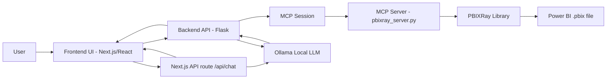
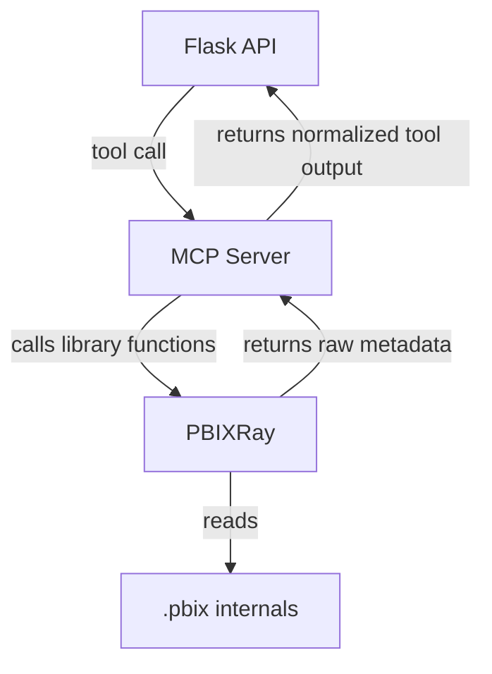
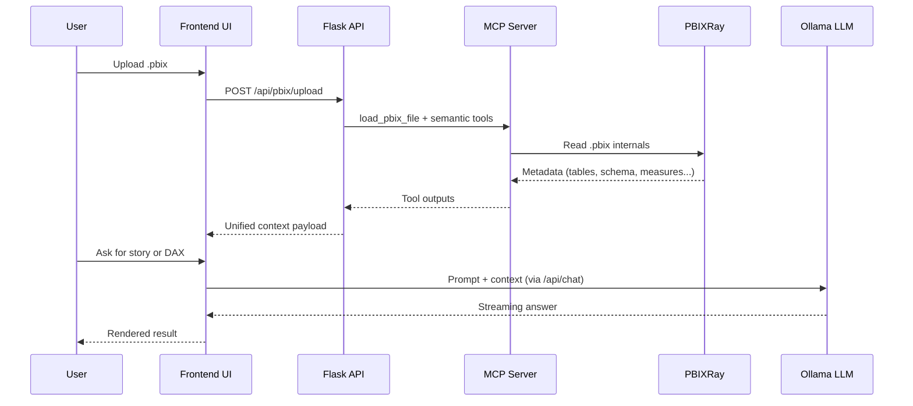
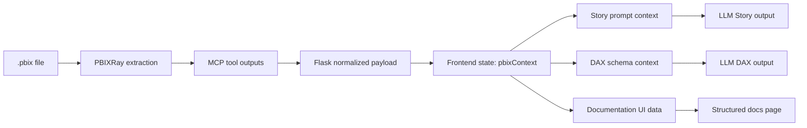
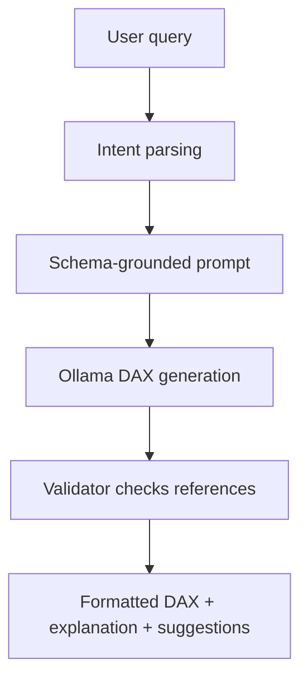
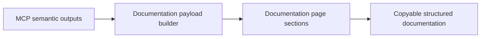

# Power BI Assistant with MCP and PBIXRay

**Technical Documentation (Beginner-Friendly, End-to-End)**

**Author:** [To be completed]  
**Date:** 2026-04-20

\newpage

## 1) Simple Introduction (Non-Technical)

This project is an AI assistant for Power BI files.

In simple words, you give the system a `.pbix` file (the Power BI project file), and it helps you:

- understand the model behind your report,
- generate business storytelling text,
- generate DAX formulas from plain language,
- and automatically produce structured technical documentation.

It is designed for people who are not experts in data modeling, not experts in DAX, and not experts in AI systems.

---

## 2) Project Context, Goals, and Expected Outcomes

### 2.1 Context

Power BI projects often become complex very quickly:

- many tables,
- many relationships,
- many measures,
- little documentation,
- and dependence on specialized technical skills.

When this happens, new team members need a lot of time to understand a model, and even experienced users can make mistakes when writing DAX.

### 2.2 Why this project was built

This project was built to reduce that complexity and accelerate understanding.  
It provides a local AI workflow (running on your machine) that can inspect a Power BI file and produce useful outputs immediately.

### 2.3 Main goals

1. Make Power BI model understanding faster.
2. Help users generate DAX from natural language.
3. Provide readable storytelling summaries for decision-makers.
4. Create automatic, structured documentation.
5. Keep the architecture modular and extensible.

### 2.4 Expected outcomes

After using this system, a user should be able to:

- understand what is inside a `.pbix` model,
- generate and adapt DAX formulas faster,
- communicate insights to business stakeholders more clearly,
- and keep documentation more up-to-date with less manual effort.

---

## 3) Global Architecture Overview

The project is composed of seven major blocks:

1. **Power BI Desktop** (authoring tool where `.pbix` files are created),
2. **Frontend UI** (the user interface used to upload and request outputs),
3. **Backend API (Flask)** (the orchestrator, meaning the central coordinator),
4. **MCP server** (tool gateway layer for semantic model extraction),
5. **PBIXRay** (parser that reads internals of `.pbix` files),
6. **Ollama + LLM** (local AI generation engine),
7. **Optional fallback assumptions** (used only as explicit assumptions when real context is unavailable).

### 3.1 Global architecture diagram

If Mermaid is not rendered in your viewer, read it as:  
User -> Frontend -> Flask -> MCP server -> PBIXRay -> `.pbix` for extraction, and for AI generation the current primary Story/DAX path is Frontend -> Next.js `/api/chat` -> Ollama -> Frontend (with Flask still available for backend orchestration paths).

---

## 4) Component-by-Component Explanation

## 4.1 Power BI Desktop

**Power BI Desktop** (Microsoft tool for building data reports) is where the `.pbix` file comes from.

What it contributes in this project:

- the semantic model (tables, columns, relationships, measures),
- data transformation logic (Power Query),
- metadata needed for analysis.

Important: this project does not modify Power BI Desktop directly.  
It analyzes exported/saved `.pbix` files and returns guidance or generated content.

---

## 4.2 Custom visual / frontend

In this repository, the active user interface is a **web frontend** built with Next.js + React.  
A custom visual (Power BI embedded plugin) is a possible deployment style, but the implemented interface here is the standalone web app.

Frontend responsibilities:

- file upload (`.pbix`),
- keeping extracted model context in shared state (`PBIXContext`),
- launching use cases (Storytelling, DAX, Documentation),
- rendering streaming responses and structured results.

Main frontend pages:

- **Home**: entry point and use-case selection.
- **Storytelling**: business narrative generation.
- **DAX Generator**: natural language to DAX.
- **Documentation**: model metadata explorer.

---

## 4.3 Backend API (Flask)

**Flask** (a lightweight Python web framework) acts as the orchestrator.

Its job is to:

- receive frontend API calls,
- open an MCP session to collect semantic model context,
- build normalized payloads for Storytelling/DAX/Documentation,
- call Ollama when needed,
- and return results to the frontend.

Key endpoints:

- `GET /api/pbix/context` -> analyze a file path and return full context.
- `POST /api/pbix/upload` -> upload `.pbix`, analyze it, return context.
- `GET /api/ollama/models` -> list available local models.
- `POST /api/dax/generate` -> backend SSE DAX stream endpoint (available path).

---

## 4.4 MCP server

**MCP (Model Context Protocol)** is a standard way for AI systems to call external tools in a structured and safe way.

Here, the MCP server (`src/pbixray_server.py`) exposes semantic extraction tools such as:

- `load_pbix_file`
- `get_tables`
- `get_statistics`
- `get_schema`
- `get_relationships`
- `get_dax_measures`
- `get_dax_columns`
- `get_power_query`
- `get_m_parameters`
- `get_model_summary`
- `get_rls_roles`

So instead of Flask directly querying PBIX internals, Flask asks MCP tools for all model context.

---

## 4.5 PBIXRay

**PBIXRay** is a Python library that can read internals of a Power BI `.pbix` file.  
Think of it as a specialized parser for Power BI model metadata.

PBIXRay provides raw extraction capability.  
The MCP server wraps that capability into tool calls.  
The Flask backend consumes those tool results.

---

## 4.6 Ollama / LLM

**Ollama** is a local runtime for large language models (LLMs).  
An **LLM** is an AI model that generates text based on instructions and context.

In this project:

- Storytelling output is generated by an LLM with strict section rules.
- DAX output is generated by an LLM with schema-grounded prompts and post-validation.

This local setup improves privacy and control because model inference happens on the user machine.

---

## 4.7 Optional mock/fallback context

A **fallback context** is a backup context used when the main context source is unavailable.

Current behavior in the DAX MCP-first pipeline:

- if real context exists in request payload, it is used;
- otherwise the route can ask Flask for context;
- if valid context still cannot be obtained, it fails clearly with an explicit error.

Important: legacy behavior that fabricated fake schema context was intentionally removed in the current DAX MCP-first route to avoid hallucinated DAX fields.

---

## 5) Relationship Between PBIXRay and MCP

This relationship is central:

- **PBIXRay** does the low-level extraction work.
- **MCP server** exposes PBIXRay operations as high-level callable tools.
- **Flask backend** consumes those tools.

So, MCP is the interface layer and PBIXRay is the extraction engine.

### 5.1 Component interaction diagram

If Mermaid is not rendered: Flask never reads `.pbix` internals directly; it requests MCP tools, and MCP tools internally rely on PBIXRay.

---

## 6) How Frontend Communicates with Backend

Frontend-backend communication is HTTP-based (web API calls):

1. Frontend sends file upload request (`POST /api/pbix/upload`).
2. Backend returns parsed model context payload.
3. Frontend stores payload in shared state (`pbixContext`).
4. For Storytelling and DAX, frontend route `/api/chat` sends model context plus prompt to AI pipeline.
5. Response is streamed back and rendered in UI.

Concrete example:

- User uploads `SalesModel.pbix`.
- Frontend receives `tables`, `columns`, `measures`, `relationships`, `documentation`, `rawContext`.
- User opens DAX page and writes: "Create gross margin percentage."
- Frontend sends query + context to `/api/chat` with `mode: "dax"`.

---

## 7) How Backend Gets Context and Sends It to the LLM

This is the core technical pipeline:

1. Flask opens an MCP stdio client session.
2. Flask calls `load_pbix_file` and semantic tools.
3. Flask parses tool JSON outputs and normalizes fields.
4. Flask builds:
   - story context (`context`),
   - prompt-ready compact text (`rawContext`),
   - structured documentation object (`documentation`),
   - model entities (`tables`, `columns`, `measures`, `relationships`).
5. Frontend or route layer sends relevant subset to Ollama.
6. LLM response is returned as streamed text.

---

## 8) Full Workflow: From User Action to Final Result

### 8.1 Sequence diagram of request flow

### 8.2 Execution flow in plain words

- Step A: Load model context once from `.pbix`.
- Step B: Reuse that context across multiple use cases.
- Step C: For each use case, send focused context to the LLM.
- Step D: Show generated output immediately in UI.
- Step E: User can copy result into Power BI (for example DAX measure).

---

## 9) Data Flow Diagram

If Mermaid is not rendered: Data starts in `.pbix`, is extracted by PBIXRay through MCP tools, normalized by Flask, stored in frontend state, then reused for Storytelling, DAX, and Documentation.

---

## 10) Implemented Use Cases (With Examples)

## 10.1 Use case A - Storytelling

### Purpose

Transform technical model context into business-readable narrative sections.

### Input

- `.pbix` model context
- user prompt (or default storytelling instruction)

### Output

Structured markdown with:

- Overview
- Key Insights
- Risks or Data Quality Concerns
- Recommended Actions

### Example

User action: "Generate a business story for this HR model."  
Expected output: clear narrative for managers, not technical developers.

### Storytelling diagram

---

## 10.2 Use case B - DAX generation

### Purpose

Convert natural language metric requests into valid DAX measures grounded in actual schema.

### Input

- natural language query
- model schema context (tables, columns, measures, relationships)

### Output

- generated DAX measure,
- explanation of logic,
- suggestions/variants.

### Example

Prompt: "Create a hiring rate measure equal to New Hires divided by Active Employees."

System behavior:

1. builds schema-aware prompt,
2. asks LLM for measure,
3. validates references against known columns/measures,
4. returns formatted output.

### DAX generation diagram

---

## 10.3 Use case C - DAX refactoring

### Purpose

Improve an existing DAX formula for readability, robustness, or performance.

### Current implementation status

- Supported as a prompt-driven scenario in the DAX generation workflow (user can ask to optimize/refactor).
- Validation layer checks structural and reference consistency.
- A dedicated repair module exists in codebase (`dax_repair.ts`) for normalization patterns, but it is not yet fully wired as a mandatory post-processing stage in the main route.

### Example

Prompt: "Refactor this measure to avoid divide-by-zero and improve readability: Margin = [Profit] / [Sales]"

Expected improvement:

- use `DIVIDE([Profit], [Sales], 0)` instead of raw `/`,
- cleaner formatting,
- explanation and possible variants.

### Refactoring diagram

---

## 10.4 Use case D - Automatic documentation

### Purpose

Provide a ready-to-read technical model overview without manual documentation work.

### What is documented

- report data sources,
- model tables and relationships,
- table roles and key columns,
- DAX calculated columns and measures,
- lineage hints,
- RLS and parameters (when available).

### Example

After upload, Documentation page immediately shows:

- number of tables,
- relationship list,
- extracted measures and formulas,
- parameter list.

### Documentation diagram

---

## 11) Why This Architecture Was Chosen

This architecture was selected for practical and technical reasons:

1. **Separation of concerns** (clear role per layer):
   - extraction (PBIXRay),
   - tool interface (MCP),
   - orchestration (Flask),
   - presentation (frontend),
   - generation (Ollama).
2. **MCP standardization**:
   one consistent way to query semantic model context.
3. **Local-first AI**:
   Ollama runs locally, reducing external dependency and improving privacy.
4. **Reusability of context**:
   one extraction pass serves Storytelling, DAX, and Documentation.
5. **Extensibility**:
   easy to add tools, endpoints, and use cases without rewriting everything.

---

## 12) Advantages of This Solution

- **Beginner accessibility**: non-experts can still generate useful outputs.
- **Productivity gain**: faster model understanding and faster DAX drafting.
- **Consistency**: same semantic source feeds all use cases.
- **Traceability**: outputs are grounded in extracted schema context.
- **Modularity**: components can be improved independently.
- **Local deployment**: can run offline/locally with controllable infrastructure.

---

## 13) Current Limitations

1. **Not all Power BI metadata is extractable**  
   Some sections show "Not available in extracted PBIX metadata."

2. **DAX generation still depends on LLM quality**  
   Validation reduces errors but cannot guarantee perfect business intent mapping.

3. **Custom visual integration is not the active UI implementation in this repo**  
   Current primary experience is standalone web app.

4. **Large models can impact latency**  
   Multiple extraction and generation stages may take time for complex `.pbix` files.

5. **Refactoring pipeline not fully hardened end-to-end**  
   Repair module exists but full always-on integration is not yet complete.

6. **RLS and governance depth depends on available extracted fields**  
   Coverage is constrained by available tool outputs.

---

## 14) Possible Improvements / Future Work

1. Add persistent MCP sessions or pooling to reduce repeated startup cost.
2. Strengthen automatic DAX repair and compile-like validation chain.
3. Add richer lineage visualization and dependency graphs.
4. Expand governance metadata (ownership, sensitivity, certification).
5. Improve test coverage for payload contracts and edge PBIX variants.
6. Add deployment profiles (desktop/local, team shared server, enterprise profile).
7. Add export options for generated outputs (versioned docs, reusable templates).

---

## 15) Assumptions and Clarifications

Because this document targets beginners, the following assumptions are made explicit:

1. The reader has never used Power BI internals (semantic model, DAX, RLS).
2. The reader has never used MCP (tool-calling protocol).
3. The current repository implements a web frontend, not a packaged Power BI custom visual artifact.
4. "Automatic documentation" means structured extraction-based documentation, not a full natural-language long report generated by another model step.
5. The "optional fallback context" is treated as a controlled contingency concept; in the current MCP-first DAX path, fabricated mock context is intentionally avoided.

---

## 16) Concise Conclusion

This project creates a complete local AI assistant around Power BI `.pbix` files by combining PBIXRay extraction, MCP tool standardization, Flask orchestration, and Ollama generation.

Its main value is practical: it turns a complex semantic model into understandable stories, usable DAX, and structured documentation while keeping architecture modular, explainable, and ready for future expansion.
