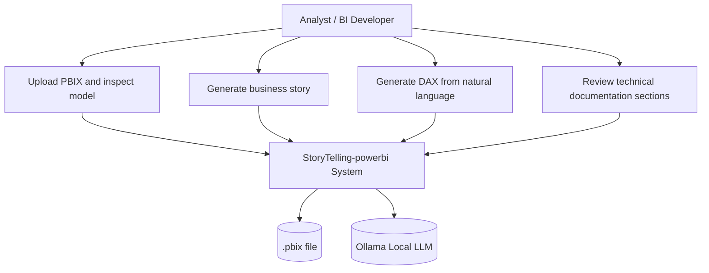
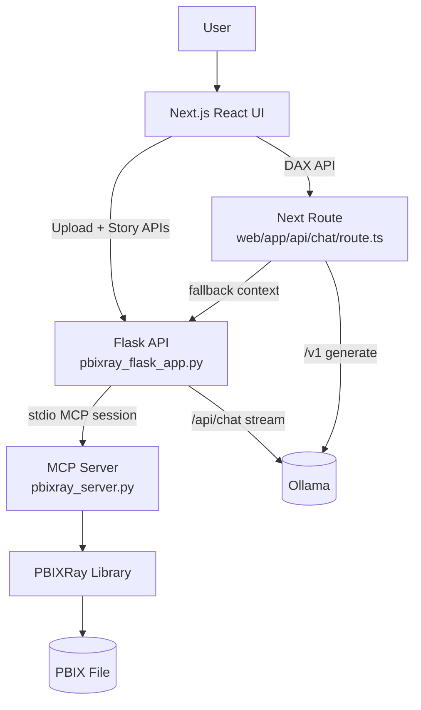
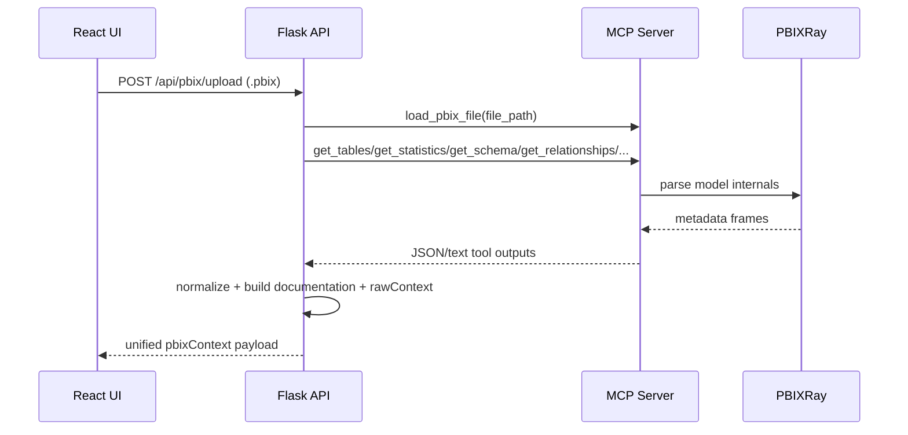
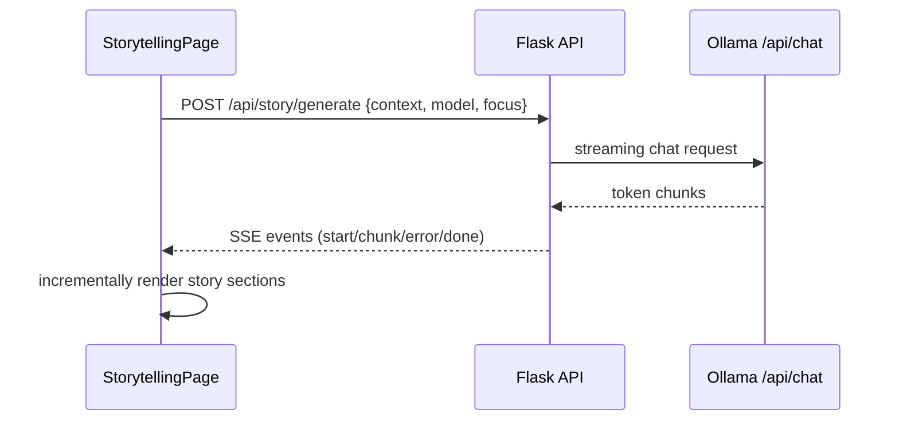
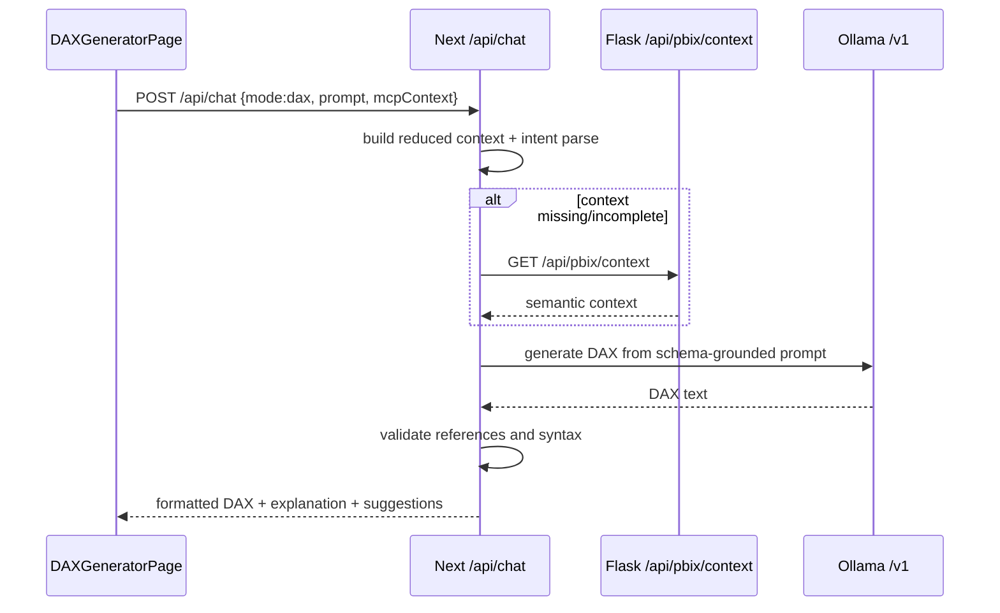
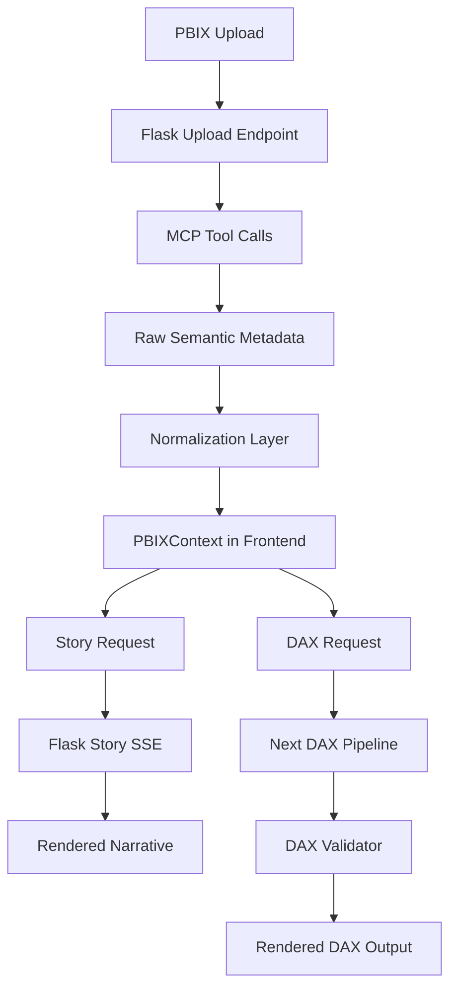
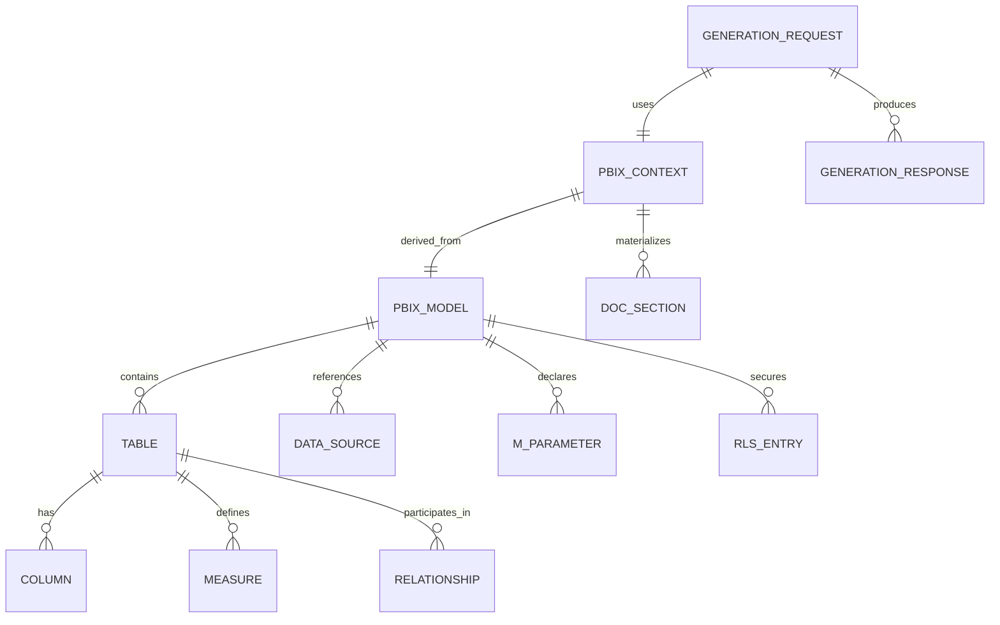

# Project Report for Supervisor

## Power BI AI Assistant (PBIXRay + MCP + Flask + Next.js + Ollama)

**Project:** StoryTelling-powerbi  
**Date:** 2026-04-21  
**Prepared for:** Supervisor presentation

---

## 1. Abstract

This project implements a local-first intelligent assistant for Power BI semantic models stored in `.pbix` files. The system combines deterministic metadata extraction (PBIXRay), tool-based orchestration (MCP), API mediation (Flask and Next.js route handlers), and local language-model inference (Ollama) to support three high-value tasks: (i) semantic model understanding, (ii) DAX generation from natural language, and (iii) business storytelling generation.

The observed implementation emphasizes schema grounding and operational robustness: DAX generation validates generated references against known model fields; storytelling and DAX workflows use streamed responses and explicit error events; and extraction logic normalizes heterogeneous MCP outputs into a stable frontend contract. The result is an end-to-end analytical copilot architecture that is modular, locally deployable, and aligned with real semantic-model metadata.

---

## 2. Introduction

Enterprise Power BI ecosystems commonly suffer from model opacity, fragmented knowledge transfer, and slow DAX authoring cycles. Manual reverse engineering of tables, relationships, and measures imposes high onboarding cost and elevated risk of semantic errors. This project addresses these constraints by introducing a machine-assisted analytical interface that converts raw `.pbix` internals into interpretable, reusable context for both technical and business-facing outputs.

The implementation goal is not generic chat interaction; it is controlled generation grounded in the actual model. To achieve this, the system separates concerns across extraction, orchestration, validation, and presentation. The frontend becomes a consumer of validated context, while backend services enforce data-shape normalization, error handling, and model-constrained generation behavior.

---

## 3. System Overview

### 3.1 Functional Scope

- Ingest `.pbix` files through upload or path-based lookup.
- Extract semantic metadata through MCP-exposed PBIXRay tools.
- Build normalized context (`tables`, `columns`, `measures`, `relationships`, `documentation`, `rawContext`, `storyContext`).
- Generate business storytelling output from context via Ollama stream.
- Generate DAX from natural language through an MCP-first pipeline with schema validation.

### 3.2 Primary Runtime Components

- `web/` (Next.js + React UI): user workflows, tabbed pages, shared PBIX context state.
- `src/pbixray_flask_app.py` (Flask): PBIX extraction orchestration and SSE generation endpoints.
- `src/pbixray_server.py` (MCP server): PBIXRay tool surface over stdio transport.
- `web/app/api/chat/route.ts` + `web/app/api/chat/dax/*`: DAX pipeline and optional story route.
- Ollama local server (`http://127.0.0.1:11434`): LLM inference backend.

### 3.3 Use Case Diagram

---

## 4. Architecture Design (with explanation)

### 4.1 Architecture / Component Diagram

### 4.2 Component Responsibilities

- **Frontend (`web/src`)**
  - Maintains shared model context in `PBIXContext`.
  - Executes upload flow (`POST /api/pbix/upload`) with progress tracking.
  - Uses dedicated hooks for story (`useStoryGeneration`) and DAX (`useDAXGeneration`) flows.
  - Renders structured outputs and documentation panels from normalized payloads.
- **Flask orchestration layer (`src/pbixray_flask_app.py`)**
  - Validates file input, orchestrates extraction, and assembles canonical response shape.
  - Bridges to MCP by spawning `pbixray_server.py` and invoking tool calls in sequence.
  - Exposes SSE endpoints for story and legacy DAX generation.
  - Applies context truncation, friendly error messages, and singleflight control for Ollama.
- **MCP server (`src/pbixray_server.py`)**
  - Wraps PBIXRay operations as callable tools (`load_pbix_file`, `get_schema`, `get_relationships`, etc.).
  - Keeps currently loaded model in process state (`current_model`).
  - Provides JSON serialization for numpy/pandas-backed outputs.
  - Offers filtered table retrieval and role/security metadata probing.
- **Next.js DAX pipeline (`web/app/api/chat/dax`)**
  - Builds reduced semantic context from `mcpContext` and/or backend fallback.
  - Constructs constrained DAX prompt with schema/measures/relationships.
  - Calls Ollama through Vercel AI SDK.
  - Validates generated DAX references against known fields and intent checks before returning output.

### 4.3 Sequence Diagrams (key flows)

#### A) PBIX ingestion and context normalization

#### B) Story generation (currently used UI path)

#### C) DAX generation (primary UI path)

### 4.4 Data Flow / Flowchart

### 4.5 Entity Relationship Diagram

### 4.6 Data Flow Explanation

1. **Acquisition:** the UI uploads a `.pbix` to Flask; Flask persists it temporarily and triggers extraction.
2. **Extraction:** Flask starts an MCP stdio session and invokes PBIXRay-backed tools (tables, schema, relationships, measures, metadata, Power Query, parameters, RLS).
3. **Normalization:** tool outputs are parsed and unified into a stable contract; derived fields include source-system inference, table roles, key columns, and documentation blocks.
4. **Reuse:** this contract is stored in frontend `PBIXContext` and consumed by Story, DAX, and Documentation tabs.
5. **Generation:** Story requests stream through Flask to Ollama; DAX requests pass through Next DAX pipeline with schema-aware validation.
6. **Presentation:** frontend incrementally renders outputs; user can stop generation via abort signals.

### 4.7 External Integrations

- **PBIXRay (Python library):** semantic extraction from `.pbix`.
- **MCP (Model Context Protocol):** tool contract and stdio communication between Flask and extraction layer.
- **Ollama (local):** LLM inference (`/api/chat` and `/v1` compatibility endpoint).
- **Vercel AI SDK (`ai`, `@ai-sdk/openai`):** Next-side model abstraction and streaming utility.

### 4.8 Security Considerations

- **Current strengths**
  - CORS for Flask APIs is constrained to localhost origins.
  - DAX output is validated against known semantic references before acceptance.
  - File upload path is isolated via temporary files and cleanup in `finally`.
- **Current risks**
  - No authentication/authorization on API endpoints.
  - `GET /api/pbix/context` accepts arbitrary local file paths if accessible by process user.
  - Upload validation is extension-based (`.pbix`) rather than content-signature based.
  - Flask runs in debug mode in direct execution path.

### 4.9 Performance and Scalability Notes

- Each extraction request creates a new MCP subprocess and replays multiple sequential tool calls.
- `get_table_contents` retrieves full table before filtering/pagination, which increases memory pressure on large tables.
- Ollama generation in Flask is guarded by a global singleflight semaphore, reducing concurrent throughput.
- Context truncation controls (`DAX_MAX_*`, `STORY_MAX_CONTEXT_CHARS`) provide latency and token-budget protection.

### 4.10 Edge Cases and Failure Handling

- **Missing/invalid input:** empty query/context or missing file fields return explicit 4xx errors.
- **Malformed backend payloads:** parser fallbacks prevent hard crashes but may degrade to empty structures.
- **Streaming disruptions:** story and DAX flows emit structured `error` and `done` events; client abort is supported.
- **Schema mismatch in generation:** DAX pipeline fails with `422` when generated references are not present in model context.
- **Large-file behavior:** MCP loading includes asynchronous progress updates for large PBIX files; smaller files use direct load path.

---

This documentation reflects observed runtime behavior in the current codebase and is suitable as a technical baseline for supervisor review and architectural governance.
